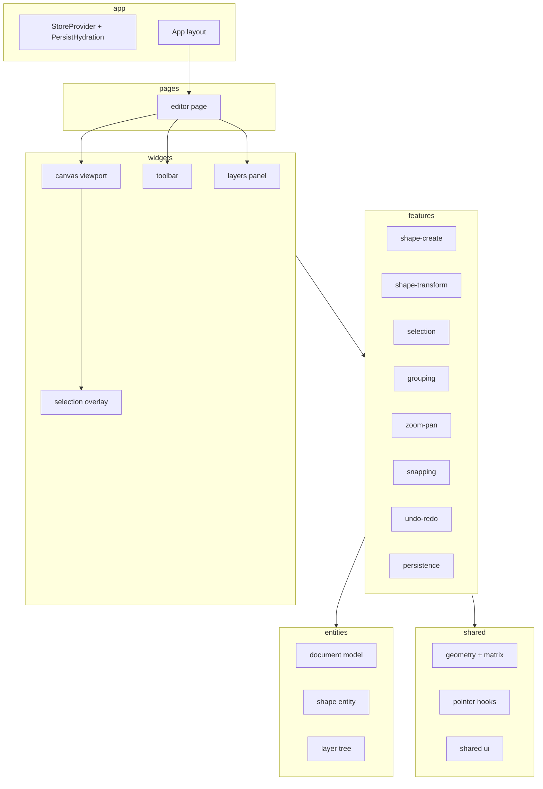
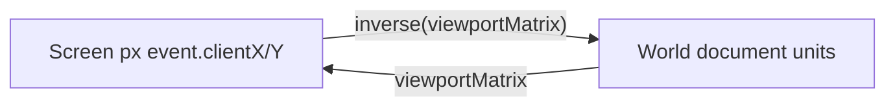
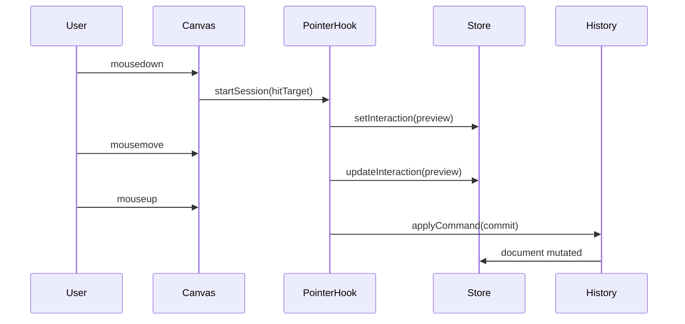

# Lightweight Figma — план реализации

## Контекст проекта

Текущий стек: [package.json](package.json) — Vite 8, React 19, TypeScript, без роутера и UI-kit. [src/App.tsx](src/App.tsx) — landing; **будет заменён** на shell редактора.



---

## Зависимости

### Обязательно добавить (runtime)

| Пакет               | Зачем                                             | Альтернатива (YAGNI)              |
| ------------------- | ------------------------------------------------- | --------------------------------- |
| **zustand**         | Документ, selection, viewport, tool, history meta | `useReducer` — вы выбрали Zustand |
| **zustand/shallow** | Подписки виджетов без лишних ре-рендеров          | ручной selector                   |
| **@dnd-kit/core**   | DnD-контекст, sensors, collision detection        | —                                 |
| **@dnd-kit/sortable** | Drag reorder строк в Layers panel              | ручной HTML5 DnD в панели         |
| **@dnd-kit/utilities** | `CSS.Transform`, arrayMove helpers            | встроено в sortable               |

**Почему @dnd-kit, а не react-dnd:** меньше boilerplate для sortable-списков, нормальная клавиатура/a11y, хорошо с React 19; для канваса всё равно не подходит.

### Разделение DnD: библиотека vs pointer

| Сценарий | Реализация |
| -------- | ---------- |
| Reorder слоёв в **Layers panel** | **@dnd-kit** (`DndContext` + `SortableContext` + `useSortable`) |
| Drag фигур на **SVG canvas** | **Свой** `usePointerSession` (world coords, snap, rotation) |
| Resize / rotate handles | Pointer (dnd-kit не умеет free-transform) |
| Pan / marquee / create | Pointer |

Так сохраняем демонстрацию кастомных `mousedown/move/up` на канвасе и не изобретаем sortable-список вручную (KISS для панели слоёв).

### Намеренно НЕ добавляем

- Canvas-библиотеки: Konva, Fabric, Pixi, Paper.js
- **react-dnd** (уступаем @dnd-kit для UI-списков)
- Геометрия: gl-matrix, transformation-matrix (2D affine — ~80 строк в `shared/lib`)
- Router (пока одна страница)
- UI-kit: MUI, Radix (достаточно CSS modules / простых `shared/ui`)

### Опционально (этап 9+, только если больно без них)

| Пакет                                   | Когда                                                                                               |
| --------------------------------------- | --------------------------------------------------------------------------------------------------- |
| **immer**                               | Глубокие nested updates в группах; можно отложить — плоский `Record<id, Shape>` + immutable helpers |
| **vitest** + **@testing-library/react** | Unit-тесты geometry/snap/commands                                                                   |

### Уже есть в проекте

`react`, `react-dom`, `typescript`, `vite`, `@vitejs/plugin-react` — достаточно.

### ID и persistence без deps

- `crypto.randomUUID()` для `ShapeId`
- `localStorage` + `JSON.stringify` / `File` API для export/import

---

## Архитектурные принципы

- **KISS**: одна сцена, примитивы `rect` \| `ellipse` \| `group`; декомпозированный transform (`x, y, width, height, rotation`), не полный SVG path editor.
- **YAGNI**: нет текста, pen tool, булевых операций, компонентов Figma, collaborative.
- **DRY**: единый `screenToWorld` / `worldToScreen`; **@dnd-kit** только в layers-panel; на канвасе — один `usePointerSession`, общие handle-константы.
- **SOLID**: команды (`Command`) — одна ответственность; рендер фигуры не знает про snap; snap не знает про React.
- **FSD**: импорты только «вниз» (`shared` ← `entities` ← `features` ← `widgets` ← `pages` ← `app`).

### Path aliases ([vite.config.ts](vite.config.ts) + [tsconfig.app.json](tsconfig.app.json))

```
@/app, @/pages, @/widgets, @/features, @/entities, @/shared
```

---

## Модель данных (entities)

```ts
// entities/shape/model/types.ts
type ShapeId = string;

type ShapeBase = {
  id: ShapeId;
  name: string;
  parentId: ShapeId | null; // null = root
  x: number;
  y: number; // top-left в world space (до rotate)
  width: number;
  height: number;
  rotation: number; // radians, вокруг центра bbox
  fill: string;
  stroke: string;
  strokeWidth: number;
  opacity: number;
  visible: boolean;
  locked: boolean;
};

type RectShape = ShapeBase & { type: "rect" };
type EllipseShape = ShapeBase & { type: "ellipse" };
type GroupShape = ShapeBase & { type: "group"; childIds: ShapeId[] };

type Shape = RectShape | EllipseShape | GroupShape;

type EditorDocument = {
  shapes: Record<ShapeId, Shape>;
  rootChildIds: ShapeId[]; // z-order корня
};

type ViewportState = {
  panX: number;
  panY: number;
  zoom: number; // 0.1 .. 4
};

type EditorState = {
  document: EditorDocument;
  viewport: ViewportState;
  selection: ShapeId[];
  activeTool: "select" | "rect" | "ellipse" | "pan";
  grid: { enabled: boolean; size: number; snapToGrid: boolean };
  snapToObjects: boolean;
};
```

**Группы**: дети хранят `parentId`; `GroupShape.childIds` — порядок внутри группы. Мировые координаты дочерних фигур — **локальные относительно группы** (как в Figma); SVG `<g transform="...">` вкладывает детей.

**Selection overlay**: отдельный слой поверх сцены (не часть document tree) — handles, bbox, rotate handle.

---

## Координаты и transform (shared/lib)



- **Viewport matrix**: `translate(panX, panY) * scale(zoom)` на wrapper `<g id="viewport">`.
- **Shape matrix** (для SVG): центр `(cx, cy) = (x + w/2, y + h/2)` → `translate(cx,cy) rotate(deg) translate(-cx,-cy)`.
- **Hit-test**: `SVGElement.getScreenCTM()` + `DOMPoint` / ручной inverse для rect/ellipse (phase 1 — `elementFromPoint` + `data-shape-id` на hit-area).
- **Resize**: якоря в **локальной** системе выделения (с учётом rotation) — матрица 2×2 + translate в [shared/lib/affine.ts](src/shared/lib/affine.ts).

Файлы:

- [src/shared/lib/point.ts](src/shared/lib/point.ts) — Vec2, add/sub/scale
- [src/shared/lib/affine.ts](src/shared/lib/affine.ts) — compose, invert, applyToPoint
- [src/shared/lib/bbox.ts](src/shared/lib/bbox.ts) — AABB, union, anchors (nw, n, ne, …)
- [src/shared/lib/snap.ts](src/shared/lib/snap.ts) — чистые функции (phase 7)

---

## Zustand + History (features/history)

**Один store** `useEditorStore` со слайсами (файлы в `features/*/model` или `entities/document/model/store.ts`):

| Slice       | Ответственность                        |
| ----------- | -------------------------------------- |
| `document`  | shapes, rootChildIds, CRUD             |
| `selection` | ids, select/toggle/clear               |
| `viewport`  | pan, zoom, wheel                       |
| `tool`      | activeTool                             |
| `ui`        | grid settings                          |
| `history`   | past[], future[], `canUndo`, `canRedo` |

**Command pattern** (не zundo на первом этапе — прозрачнее для портфолио):

```ts
interface Command {
  readonly name: string;
  execute(api: StoreApi): void;
  undo(api: StoreApi): void;
}

// Примеры: AddShape, MoveShapes, ResizeShape, RotateShape,
// ReorderLayer, GroupShapes, UngroupShapes, UpdateViewport (опционально в history)
```

- `applyCommand(cmd)` → `cmd.execute` → push в `past`, clear `future`
- Лимит стека: 50–100 (константа)
- **Во время drag**: preview через `interaction` slice (transient, **не** в history) → `commitCommand` на `mouseup`

```ts
type InteractionState = {
  mode: 'idle' | 'drag' | 'resize' | 'rotate' | 'marquee' | 'create';
  snapshot?: Partial<...>;
} | null;
```

---

## Структура каталогов FSD

```
src/
  app/
    App.tsx                 # layout: toolbar | canvas | layers
    providers/
    styles/global.css
  pages/
    editor/ui/EditorPage.tsx
  widgets/
    canvas/ui/Canvas.tsx
    canvas/ui/Viewport.tsx
    canvas/ui/ShapeLayer.tsx
    selection-overlay/ui/SelectionOverlay.tsx
    toolbar/ui/Toolbar.tsx
    layers-panel/ui/LayersPanel.tsx
  features/
    shape-create/
    shape-transform/        # drag, resize, rotate
    selection/                # click, marquee, multi
    grouping/
    viewport/                 # zoom, pan, wheel
    layer-reorder/            # @dnd-kit → ReorderCommand
    snapping/
    history/
    persistence/              # localStorage + JSON IO
  entities/
    shape/ui/ShapeView.tsx    # <rect>|<ellipse> per type
    shape/lib/serialize.ts
    layer/lib/buildTree.ts
    document/model/store.ts   # zustand root
  shared/
    lib/                      # math
    hooks/usePointerSession.ts
    hooks/useWindowPointerCapture.ts
    ui/Button, Icon, Panel
    config/constants.ts
```

---

## UI / UX shell (замена App)

```
+------------------------------------------------------------------+
| Toolbar: [Select][Rect][Ellipse][Pan] | undo redo | grid snap   |
+----------+-------------------------------------------+-----------+
| Layers   |  Canvas (SVG infinite-ish artboard)       | (optional)|
| panel    |  - grid pattern background                | props YAGNI|
| tree     |  - viewport <g>                           |           |
|          |  - shapes + overlay                       |           |
+----------+-------------------------------------------+-----------+
| Status: zoom % | cursor world x,y | saved indicator              |
+------------------------------------------------------------------+
```

Keyboard (phase 4+): `Delete`, `Ctrl+Z/Y`, `Ctrl+G/U`, `Space+drag` = pan, `[` `]` nudge z-order.

---

## Этапы реализации

### Этап 0 — Скелет FSD и store (0.5–1 день)

- Path aliases, удалить landing-контент из [src/App.tsx](src/App.tsx) / [src/App.css](src/App.css)
- Установить `zustand`, `@dnd-kit/core`, `@dnd-kit/sortable`, `@dnd-kit/utilities`
- Пустой `EditorPage`, `Canvas` с SVG 3000×3000, сетка CSS/SVG pattern
- `useEditorStore` с начальным `document` (1 demo rect)
- `npm run build` без ошибок

**Критерий готовности**: сцена рендерится, store читается в React DevTools.

---

### Этап 1 — Рендер примитивов + координаты (1–2 дня)

**features/shape-create**, **entities/shape**

- `ShapeView`: `<rect>` / `<ellipse>` (ellipse: `cx,cy,rx,ry` из bbox)
- Атрибут `data-shape-id` на hit-target (прозрачный fill или stroke hit slop)
- `viewport` `<g transform={...}>` — пока zoom=1, pan=0
- `screenToWorld` / `worldToScreen` + unit-тесты на affine (если vitest — иначе manual checklist)

**Критерий**: 2+ фигуры из store отображаются в правильном z-order (`rootChildIds`).

---

### Этап 2 — Selection + создание фигур (1–2 дня)

**features/selection**, **features/shape-create**

- Tool `rect` / `ellipse`: mousedown → drag preview → mouseup → `AddShapeCommand`
- Tool `select`: click → selection; click empty → clear; Shift+click toggle
- Визуал selection: stroke bbox (overlay layer)
- Курсор над handle areas — default (handles в этапе 3)

**Критерий**: можно нарисовать rect/ellipse и выделить кликом.

---

### Этап 3 — Drag + Resize (2–3 дня)

**features/shape-transform**, **widgets/selection-overlay**

- `usePointerSession`: `{ down, move, up }` + `setPointerCapture` на SVG root
- **Drag**: delta world; multi-selection — общий delta; respect `locked`
- **8 anchors + 4 edges**: курсоры `nwse-resize` / `ns-resize` / `ew-resize` в локальной системе rotation
- Min size 4px, Shift = preserve aspect ratio (опционально YAGNI+1)
- `MoveShapesCommand`, `ResizeShapesCommand` на commit

**Критерий**: drag и resize у выделенной rotated фигуры ведут себя предсказуемо.

---

### Этап 4 — Rotate + Marquee (1–2 дня)

- Rotate handle над bbox (offset ~24px world); угол от центра к pointer
- `RotateShapesCommand`
- Marquee selection: rect в overlay, intersection с AABB фигур (учёт rotation — bbox углов или упрощённый AABB мировой — **MVP: мировой AABB**)

**Критерий**: поворот + рамка выделения.

---

### Этап 5 — Layers panel + z-order (1–1.5 дня, быстрее с dnd-kit)

**widgets/layers-panel**, **entities/layer**, **features/layer-reorder**

- `buildLayerTree(document)` → плоский или nested список для UI
- Список: icon type, name, eye (visible), lock
- Click row → selection (без drag)
- **Reorder через @dnd-kit**:
  - `DndContext` + `PointerSensor` / `KeyboardSensor` только вокруг панели (не на canvas)
  - `SortableContext` с `items={siblingIds}` + `verticalListSortingStrategy`
  - `restrictToVerticalAxis` ([@dnd-kit/modifiers](https://docs.dndkit.com/) — опционально, `bun add @dnd-kit/modifiers`)
  - `onDragEnd`: `arrayMove` → `ReorderLayerCommand` (обновить `rootChildIds` или `group.childIds`)
- Вложенные группы (MVP): один sortable-список на уровень (indent + отдельный `SortableContext` per parent) — без drag между уровнями до этапа 6
- Shortcuts `]` / `[` — дублируют reorder без мыши

```tsx
// features/layer-reorder/lib/onLayerDragEnd.ts
// active.id / over.id → fromIndex, toIndex → applyCommand(ReorderLayerCommand)
```

**Критерий**: drag строки в панели меняет z-order на canvas; undo откатывает reorder.

---

### Этап 6 — Grouping (1–2 дня)

**features/grouping**

- `Ctrl+G`: `GroupShapesCommand` — общий parent, bbox группы = union children (local coords пересчёт при создании)
- `Ctrl+Shift+G`: ungroup — children на root/parent с мировым transform
- Рендер: `<g transform>` wrapper для group; children внутри
- Selection group → transform как единое (drag/resize/rotate группы)

**Критерий**: group/ungroup сохраняет визуальное положение.

---

### Этап 7 — Zoom / Pan (1–2 дня)

**features/viewport**

- Pan tool + **Space + drag** (временно `activeTool=pan`)
- Wheel zoom к курсору: изменить `zoom` и подкрутить `pan` чтобы точка под курсором стационарна
- UI: zoom %, кнопки fit / 100%
- Overlay handles масштабируются inversely (`strokeWidth / zoom`) — иначе handles огромные

```ts
// zoom at cursor
const worldBefore = screenToWorld(mouse);
setZoom(newZoom);
const worldAfter = screenToWorld(mouse);
pan += worldBefore - worldAfter;
```

**Критерий**: Figma-like navigation без лагов на 50 фигурах.

---

### Этап 8 — Snapping (2 дня)

**features/snapping**, **shared/lib/snap.ts**

1. **Grid snap** (если enabled): round x/y к `grid.size` при move/create/resize
2. **Object snap**: для движущейся bbox — кандидаты edges/centers всех невыделенных фигур; threshold `8px / zoom` в world
3. Визуал guide lines (overlay, временные линии)

Алгоритм (KISS):

- Собрать snap points target shape (4 edges + center × 2 axes)
- Для каждой стороны/центра moving bbox найти min distance
- Применить smallest delta under threshold

**Критерий**: прилипание к сетке и к краям соседнего rect.

---

### Этап 9 — Undo / Redo (1–2 дня)

**features/history**

- Все мутирующие операции только через `applyCommand`
- Toolbar buttons + Ctrl+Z / Ctrl+Y
- Transient interaction **не** попадает в past до mouseup
- Опционально: merge move commands в пределах 300ms (debounce merge) — YAGNI, можно пропустить

**Критерий**: 10 действий → undo до начала → redo восстанавливает.

---

### Этап 10 — Persistence JSON + localStorage (1 день)

**features/persistence**

- Schema version `EDITOR_SCHEMA_VERSION = 1`
- `serialize(document + viewport + grid)` / `deserialize` с валидацией (type guards, без `any`)
- Autosave debounce 500ms → `localStorage['lightweight-figma-doc']`
- Toolbar: Export `.json`, Import file input
- Hydration on mount: load localStorage или default scene

**Критерий**: refresh страницы восстанавливает сцену; import/export roundtrip.

---

### Этап 11 — Полировка и производительность (1 день)

- `React.memo(ShapeView)` + selector per shape id
- `will-change: transform` только на dragging
- `user-select: none` на canvas; prevent default middle/wheel где нужно
- A11y: keyboard focus toolbar, `aria-label` на tools
- ESLint boundaries (опционально eslint-plugin-import для FSD layers)

---

## Поток событий мыши (reference)



Hit priority: **overlay handles** > **shapes top-down** > **canvas background** (pan/marquee/deselect).

---

## Риски и mitigations

| Риск                              | Mitigation                                                |
| --------------------------------- | --------------------------------------------------------- |
| Rotation + resize математика      | Локальная система координат selection; тесты на 45°/90°   |
| Производительность React          | Transient slice; memo ShapeView; shallow selectors        |
| Group transform drift             | При group: snapshot world corners → пересчёт local once   |
| Zustand + StrictMode double mount | Persistence hydrate после mount; не double-apply commands |
| SVG hit-test с zoom               | Всегда переводить pointer через `screenToWorld`           |

---

## Оценка сроков

| Этапы                                  | Суммарно                 |
| -------------------------------------- | ------------------------ |
| 0–2 MVP (render, create, select)       | ~3–5 дней                |
| 3–6 Manipulation + layers + groups     | ~5–9 дней                |
| 7–10 Pro (viewport, snap, history, IO) | ~5–6 дней                |
| 11 Polish                              | ~1 день                  |
| **Итого**                              | **~14–21 день** solo dev |

---

## Порядок команд для старта реализации

```bash
bun add zustand @dnd-kit/core @dnd-kit/sortable @dnd-kit/utilities
# опционально: bun add @dnd-kit/modifiers
# настроить aliases в vite + tsconfig
# создать FSD папки и пустой EditorPage
```

Первый осмысленный PR/commit: **Этап 0 + 1** (скелет + SVG shapes + viewport math).
